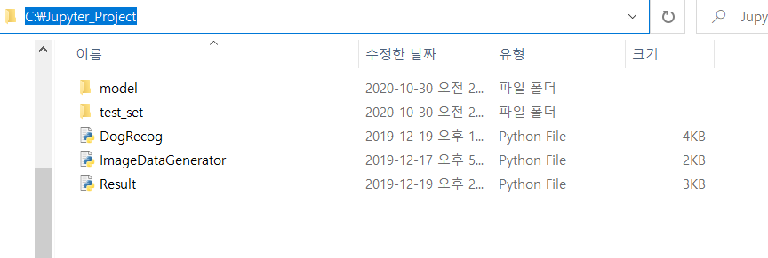

## Dog-Breed-Classifier

비글, 불독, 치와와, 골든 리트리버, 포메리안, 토이 푸들, 요크셔테리어
총 9종의 강아지 품종을 분류할 수 있도록 학습

강아지의 이미지는 크롤링과 ImageDataGenerator를 통해 각각 5000~6000장 확보

### How To Run With Web Application

위와 같이 C: 드라이브 아래에 Jupyter_Project 폴더를 만든 후 해당 파일을 클론
