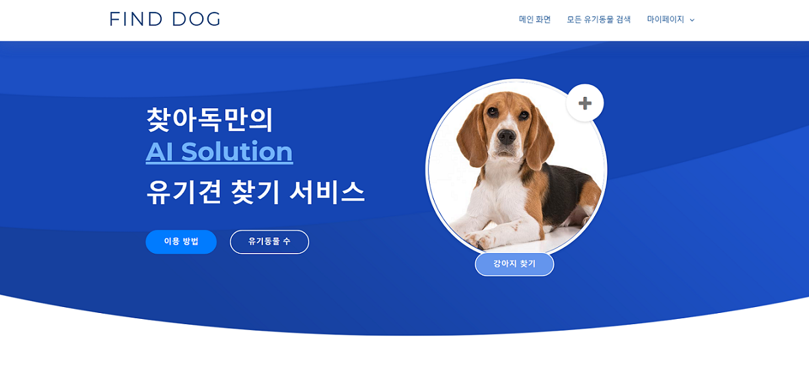

## Find Dog (P-Project)
이미지 인식을 이용한 유기견 매칭 서비스

### Preview

### Main Function
- 로그인, 로그아웃, 회원가입, 회원정보수정
- 날짜, 축종, 상태에 따른 유기견 검색 
- 이미지 인식을 통한 유기견 검색
- 유기견 상세정보 확인

### Tech Stack
|Frontend    |Backend         |Database    |AI            |API                   |
|------------|----------------|------------|--------------|----------------------|
|`Bootstrap` |`PHP`           |`Maria DB`  |`Tensorflow`  |`Public Data Open API`|
|            |`Zend OPcache`  |            |`Keras`       |                      |

### Developer
- Yunghoon Jeong, 정영훈
- Seunghwan Lee, 이승환
- Seunghoon Pyo, 표승훈
- Seunghwan Hwang, 황승환
